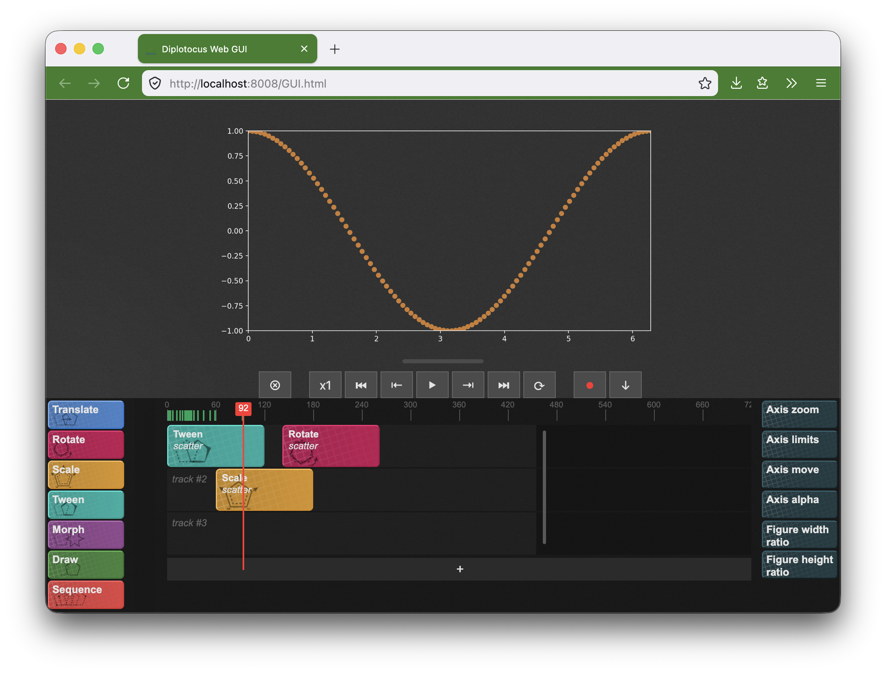

Welcome to diplotocus' documentation!
======================================

.. raw:: html

   

   <video width="700" height="394" autoplay muted playsinline>
       <source src="_static/logo.mp4" type="video/mp4">
   </video>
   

**Diplotocus** is a python package designed to render animations of `matplotlib <https://matplotlib.org/>`_ objects, in a *timeline* style.

Here's a quick example of the syntax of diplotocus:

.. code-block:: python

   import diplotocus as dpl
   import numpy as np

   #We define our Timeline, the object that handles all animations on our figure
   tl = dpl.Timeline(xlim=(0,6*np.pi),ylim=(-1,1))

   #We generate data points
   x = np.linspace(0,6*np.pi,200)
   y = np.cos(x)

   #We create a plot() object
   p = dpl.plot(x=x,y=y)

   #We draw its data points sequentially
   p.draw(duration=100)
   tl.animate(p)

   #We wait 25 frames
   tl.wait(duration=25)

   #We unzoom and move the axis to (0,0)
   az = dpl.axis_zoom(zoom=0.5,duration=50)
   am = dpl.axis_move(end_pos=(0,0),duration=50)
   tl.animate((az,am))

   #We hide the plot
   p.hide(duration=100)
   tl.animate(p)

   #We render our video
   tl.save_video(path='../_static/demo.mp4')

.. raw:: html

   

   <video width="640" height="360" autoplay loop muted playsinline>
       <source src="_static/demo.mp4" type="video/mp4">
   </video>
   

**Diplotocus** also features a Web GUI that lets you put your animations together visually, in a timeline-like manner:

Get started by :doc:`Installing Diplotocus <notebooks/installation>`, and follow the :doc:`Quick-Start guide <notebooks/quick-start>`.
For examples, see the :doc:`Examples <notebooks/examples>` page.

.. toctree::
   :maxdepth: 2
   :caption: Getting Started

   notebooks/installation
   notebooks/quick-start

.. toctree::
   :maxdepth: 3
   :caption: Library reference
   
   notebooks/timeline
   notebooks/plot_objects
   notebooks/animations
   notebooks/easings
   notebooks/projects
   notebooks/GUI
   notebooks/examples

.. toctree::
   :maxdepth: 2
   :caption: API Reference

   api/index
